# AWS_S3_PublicBucket_Demo
This project documents the step-by-step process of creating a publicly accessible Amazon S3 bucket, configuring granular permissions, and implementing bucket versioning for data durability.

## 📌 Project Overview
The goal of this project is to demonstrate how to host objects in the cloud, manage public access safely using ACLs, and maintain a history of file changes through versioning.

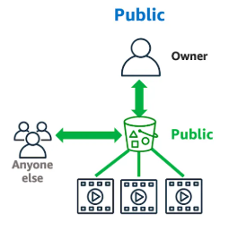

---

## Steps-by-Steps Implementation

### 1. Bucket Initialization
* **Service**: Amazon S3
* **Region:** Asia Pacific (Osaka) `ap-northeast-3`
* **Configuration:** Created a bucket within the Global Namespace with a unique identifier.

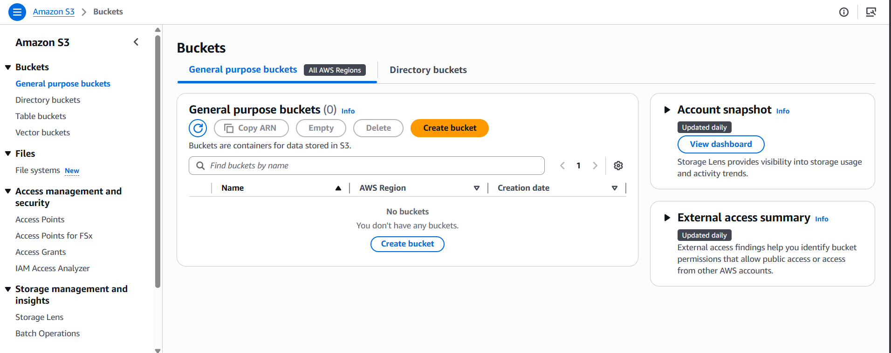

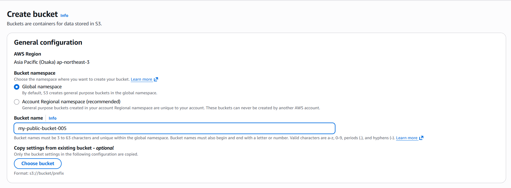
  
### 2. Security & Access Configuration
To allow the bucket to host public content, the default security settings were modified:
* **Object Ownership:** Enabled **ACLs (Access Control Lists)** to allow individual objects to be shared.
* **Public Access:** Disabled the **"Block all public access"** setting. 
* **Acknowledgment:** Explicitly acknowledged that the bucket and its objects would become public.

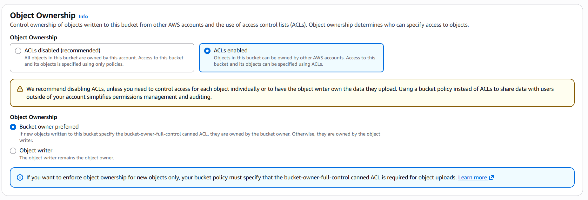

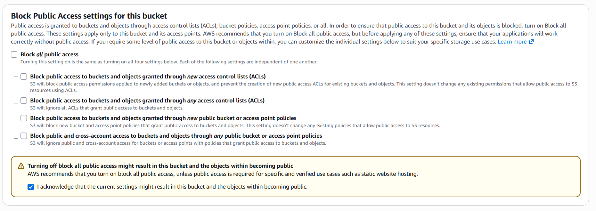

### 3. Data Durability with Versioning
* **Bucket Versioning:** Enabled this feature to keep multiple variants of an object in the same bucket.
* **Benefit:** This allows for easy recovery from unintended user actions or application failures by preserving a history of every object version.
  
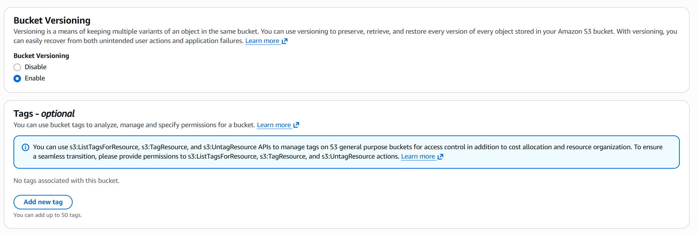

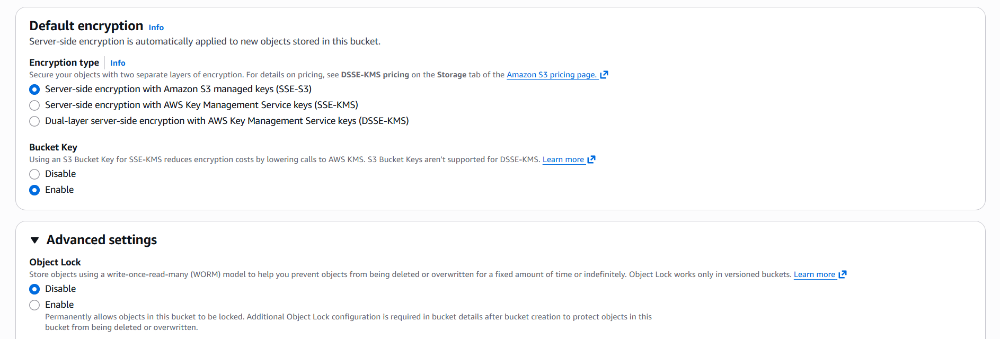

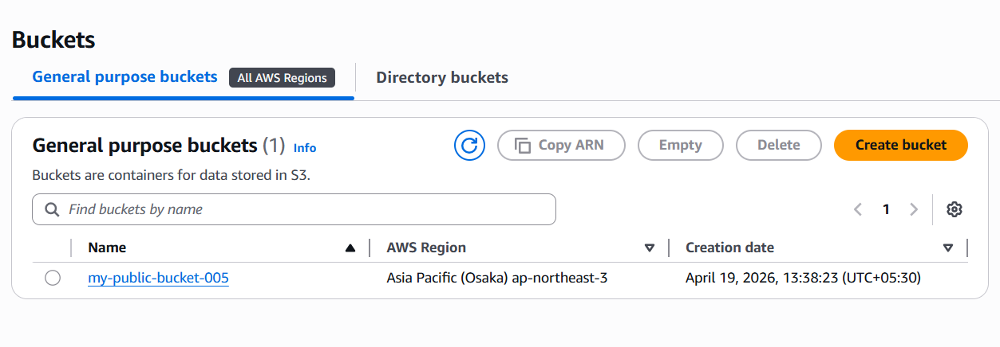

### 4. Object Upload & Public Accessibility
* **Upload:** Uploaded image files via the S3 Management Console.
* **Permissions:** After uploading, used the **"Make public using ACL"** action under the *Actions* menu.
* **Verification:** Verified the upload by accessing the **Object URL** in a browser to ensure the image rendered correctly for external users.

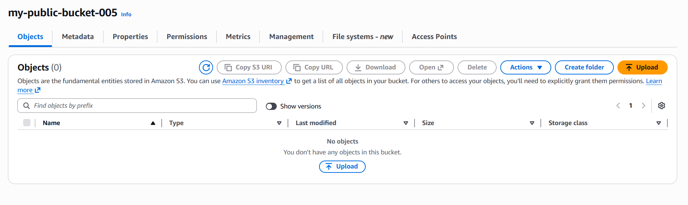

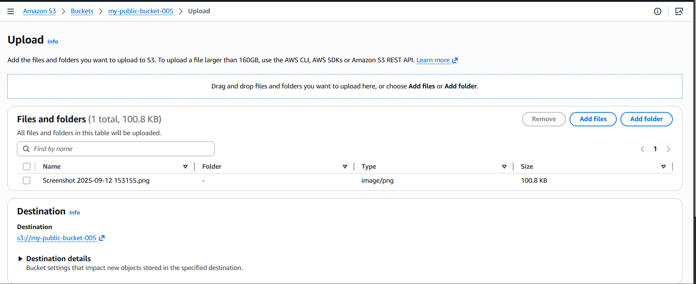

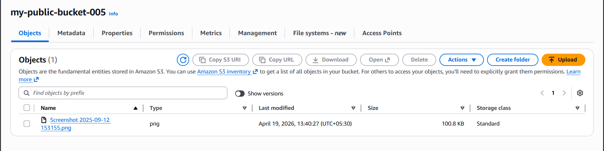

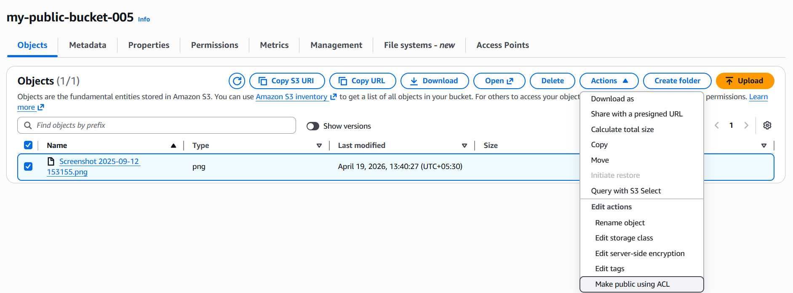

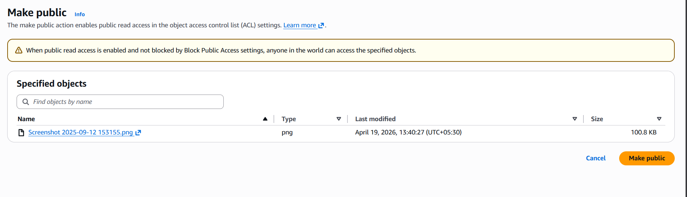

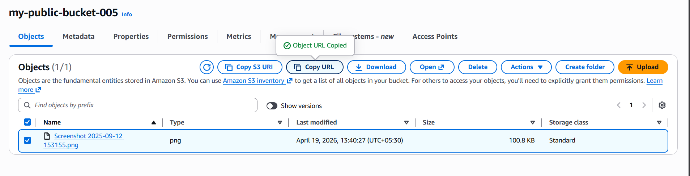

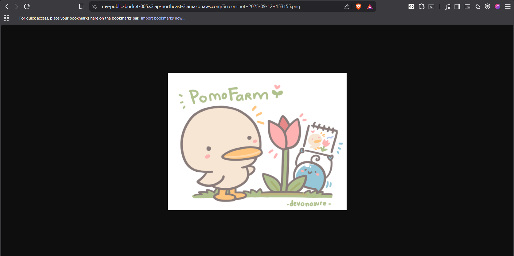

### 5. Managing Versions
* By toggling the **"Show versions"** switch, we can see the unique **Version IDs** for each file update.
* This ensures that if a file is updated or deleted, the previous state is still retrievable.

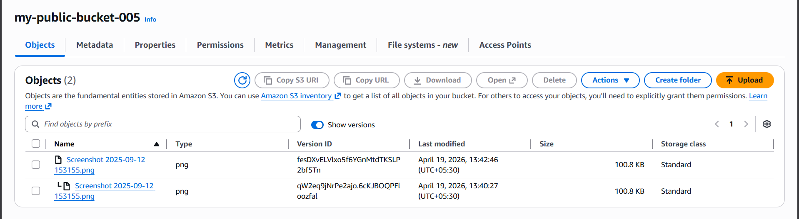

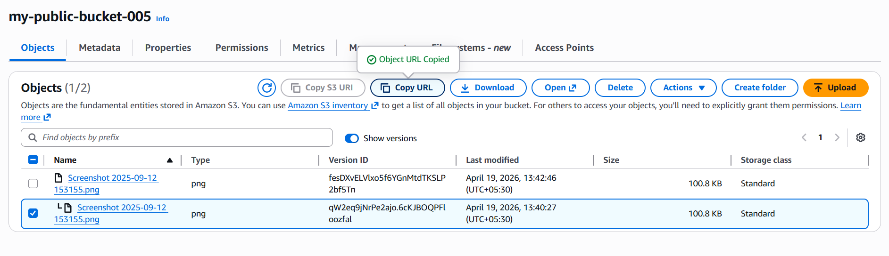

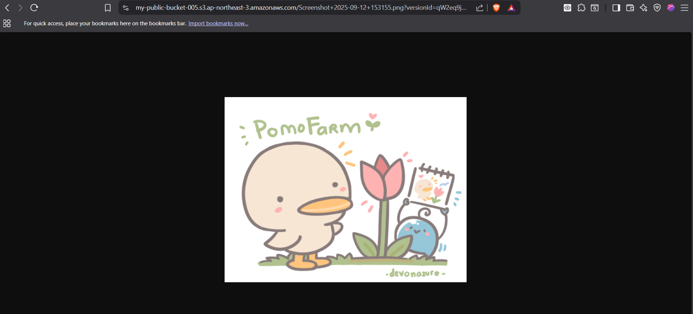

---

## 🔧 Technical Summary
| Feature           | Setting                         |
| :---------------- | :------------------------------ |
| **AWS Region**    | ap-northeast-3 (Osaka)          |
| **ACL Status**    | Enabled                         |
| **Public Access** | Allowed (Unblocked)             |
| **Versioning**    | Enabled                         |
| **Encryption**    | SSE-S3 (Server-Side Encryption) |

---

## ⚠️ Security Best Practice
While this project demonstrates public access, it is a best practice in corporate environments to use **CloudFront** or **Bucket Policies** for sharing data, and to always follow the principle of least privilege.

---

## ⚠️ Common Errors & Troubleshooting

During this process, you might encounter these common issues. Here is how to fix them:

### 1. "Access Denied" when making an object public
* **The Error:** You try to click "Make public using ACL," but AWS gives an "Access Denied" error.
* **The Cause:** This usually happens because **Block Public Access** is still turned ON at the bucket level or **ACLs** are disabled.
* **The Fix:** Go to the **Permissions** tab of your bucket, ensure "Block all public access" is unchecked, and verify that "Object Ownership" is set to **ACLs enabled**.

### 2. "403 Forbidden" when opening the Object URL
* **The Error:** You can see the file in the console, but when you click the Object URL, the browser shows `403 Forbidden`.
* **The Cause:** Uploading a file to a public bucket does **not** make the file public automatically.
* **The Fix:** You must manually select the object, go to **Actions**, and select **Make public using ACL**. Alternatively, you can use a **Bucket Policy** to make the entire folder public at once.

### 3. Bucket Name Not Available
* **The Error:** `Bucket name already exists`.
* **The Cause:** S3 bucket names are **globally unique** across all AWS accounts worldwide.
* **The Fix:** Add a unique suffix to your name, such as your initials or the current date (e.g., `my-public-bucket-ayush-2026`).

### 4. Extra Charges for Versioning
* **The Issue:** You notice your storage usage is higher than expected.
* **The Cause:** When **Versioning** is enabled, every time you upload a new version of a 10MB file, AWS stores *both* versions. If you upload it 5 times, you are paying for 50MB of storage.
* **The Fix:** Periodically clean up old versions or set up **S3 Lifecycle Rules** to permanently delete older versions after a certain number of days.